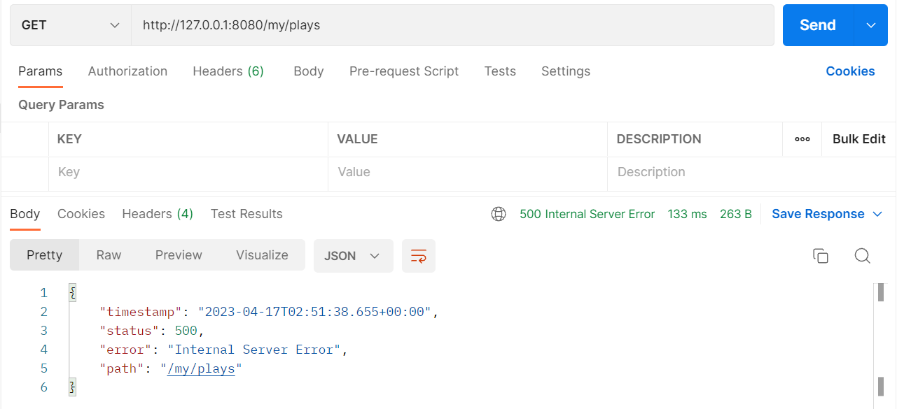

# @ControllerAdvice 정복하기

## @ExceptionHandler를 사용한 예외 처리

- `MyController`에서 발생한 예외를 `@ExceptionHandler`를 사용해 처리

```java
@RestController
@RequestMapping("/my")
public class MyController {

    @GetMapping("/plays")
    public void plays(){
        throw new IllegalArgumentException();
    }

    @ExceptionHandler(IllegalArgumentException.class)
    public ResponseEntity<String> handle() {
        return ResponseEntity.badRequest().body("IllegalArgumentException 발생!");
    }
}
```

`plays`메소드가 호출되면 어떻게 될까? `IllegalArgumentException`이 발생하고, 이 예외에 대한 처리를 `hanlde`메소드가 수행한다.

위 코드와 같이 클래스에 `@ExceptionHandler`가 붙여진 메소드를 사용해서 클래스내에서 발생한 예외를 처리할 수 있다.

<br/>

- 컨트롤러에서 발생한 예외를 전역 처리하고 싶다면?

```java
@RestController
@RequestMapping("/new")
public class NewController {

    @GetMapping("/plays")
    public void plays(){
        throw new IllegalArgumentException();
    }

    @ExceptionHandler(IllegalArgumentException.class)
    public ResponseEntity<String> handle() {
        return ResponseEntity.badRequest().body("IllegalArgumentException 발생!");
    }
}
```

여기 `NewController`가 새로 나타났다. `NewController`는 `MyController`와 동일하게 `IllegalArgumentException` 에 대한 예외 처리를 수행하고 있다.

<br/>

지금은 두 개의 컨트롤러에 로직이 반복되지만, 만약 더 많은 컨트롤러에서 `IllegalArgumentException`에 대한 동일한 예외 처리가 필요해진다면? 전역적으로 예외를 처리하면 더 깔끔하고 중복이 없는 코드를 작성할 수 있다.

## @ControllerAdvice 사용 방법

`@ControllerAdvice`를 사용하면 컨트롤러에서 발생한 예외를 전역적으로 처리할 수 있다.

```java
@ControllerAdvice
public class MyControllerAdvice {

    @ExceptionHandler(IllegalArgumentException.class)
    public ResponseEntity<String> handle(Exception exception) {
        return ResponseEntity.badRequest().body("IllegalArgumentException 발생!");
    }
}

```

- `@ControllerAdvice` 어노테이션이 있는 클래스를 생성한 뒤,
- 클래스 내부에 `@ExceptionHandler` 어노테이션이 붙여진 메소드를 생성한다.

위 과정을 통해 `MyControllerAdvice`는 `MyController`와 `NewController`에서 발생하는 `IllegalArgumentException`을 전부 처리할 수 있다.

<br/>

## 여러 개의 @ControllerAdvice를 생성할 수 있을까?

가능하다! 새로운 클래스인 `NewControllerAdvice`를 만들어보자.

이제 두 개의 `@ControllerAdvice` 클래스가 존재한다.

```java
@ControllerAdvice
public class MyControllerAdvice {

    @ExceptionHandler(IllegalArgumentException.class)
    public ResponseEntity<String> handle(Exception exception) {
        return ResponseEntity.badRequest().body("MyControllerAdvice에서 IllegalArgumentException 처리!");
    }
}
```

```java
@ControllerAdvice
public class NewControllerAdvice {

    @ExceptionHandler(IllegalArgumentException.class)
    public ResponseEntity<String> handle(Exception exception) {
        return ResponseEntity.badRequest().body("NewControllerAdvice에서 IllegalArgumentException 처리!");
    }
}
```

### 컨트롤러에서 IllegalArgumentException이 발생하면, 두@ControllerAdvice 중 어떤 것을 선택할까?

`MyControllerAdvice`와 `NewControllerAdvice`는 둘 다 `IllegalArgumentException`에 대한 예외를 처리하고 있다.

두 클래스 모두 전역적으로 예외를 처리하고 있다. 컨트롤러에서 `IllegalArgumentException`이 발생할 경우, 어떤 `@ControllerAdvice`에서 예외를 처리하게 될까?

정답은 `AnnotationAwareOrderComparator`를 기준으로 `@ControllerAdvice`를 정렬한 순으로 선택한다.

> `AnnotationAwareOrderComparator`이란?
>
> - Comparator를 구현한 클래스이다.
> - `@Order`, `@Priority`, `Ordered` 인터페이스를 사용해 원하는 정렬 기준을 설정할 수 있다.
> - 정렬이 적용되는 우선 순위는 `@Order`, `@Priority`, `Ordered` 순이다.

<br/>

`MyControllerAdvice`와 `NewControllerAdvice`가 어떻게 정렬될 지 확인해보자.


`@ControllerAdvice`는 `@Component`를 상속받고 있어, 스프링 컨텍스트가 빈으로 등록한다.

빈으로 등록된 `@ControllerAdvice`는 `HandlerExceptionResolver`의 ` exceptionHandlerAdviceCache`에 저장된다.

<br/>


` exceptionHandlerAdviceCache`에 `@ControllerAdvice` 클래스가 들어간 순서를 보자.

`MyControllerAdvice` -> `NewControllerAdvice` 순으로 들어있다.

`@ControllerAdvice` 클래스에 특별한 정렬 기준을 정해주지 않는다면, 디폴트로 클래스 이름순 정렬이 수행된다.

`MyControllerAdvice`가 가장 앞에 있기 때문에, 어느 컨트롤러에서 `IllegalArgumentException`예외가 발생하든 `MyControllerAdvice`에서 예외 처리가 수행된다.

- `MyController`에서 예외 발생


<br/>

- `NewController`에서 예외 발생


`@ControllerAdivice`에 특별한 정렬 기준을 등록하고 싶다면, `AnnotationAwareOrderComparator`를 활용한다.

## @ControllerAdvice가 적용될 클래스를 제한할 수 없을까?

가능하다! `@ControllerAdvice`에는 예외 처리를 적용할 클래스를 제한할 수 있는 여러 속성들이 존재한다.

### 📌 basePackages

`@ControllerAdvice`를 적용할 패키지를 지정한다. 지정한 패키지의 하위 패키지까지 예외 처리가 적용된다.

- 코드 예시

```java
@ControllerAdvice(basePackages = "racingcar.controller.myPackage")
public class MyControllerAdvice {

    @ExceptionHandler(IllegalArgumentException.class)
    public ResponseEntity<String> handle(Exception exception) {
        return ResponseEntity.badRequest().body("MyControllerAdvice에서 IllegalArgumentException 처리!");
    }
}
```

```java
@ControllerAdvice(basePackages = "racingcar.controller.newPackage")
public class NewControllerAdvice {

    @ExceptionHandler(IllegalArgumentException.class)
    public ResponseEntity<String> handle(Exception exception) {
        return ResponseEntity.badRequest().body("NewControllerAdvice에서 IllegalArgumentException 처리!");
    }
}
```

`racingcar.controller.myPackage` 패키지 아래에는 `MyController`가 존재하고,

`racingcar.controller.newPackage`패키지 아래에는 `NewController`가 존재한다.

- `MyController` 예외 처리 결과


<br/>

- `NewController` 예외 처리 결과


이전에 예외를 처리했을 때는, 가장 앞에 정렬되어있던 `MyControllerAdvice`가 `MyController`와 `NewController`에서 발생한 예외를 전부 처리했다. 정렬순으로 가장 앞에 있는 `Advice`를 고른 뒤, 해당 `Advice`가 클래스에서 발생한 예외를 처리할 수 있으면 `Advice`의 코드대로 예외를 처리한다.

이번 예시에는 각 `Advice`에 `basePackages`를 사용해서 예외 처리를 적용할 클래스의 범위를 제한했다. 그 결과 `NewController`에서 발생한 예외는 `NewControllerAdvice`에서 처리한 것을 볼 수 있다.

<br/>

추가로 `basePackages`는 `value`와 `@AliasFor`를 사용해 별칭을 사용하는 관계이기에, `@ControllerAdvice("racingcar.controller.newPackage")`과 같이 인자로 바로 넣어줘도 작동한다.


<br/>

### 📌 basePackageClasses

지정한 클래스가 속한 패키지를 `basePackage`로 등록한다. 즉, 지정한 클래스가 속한 패키지 하위에 존재하는 모든 컨트롤러를 예외 처리한다.

- 코드 예시

```java
@ControllerAdvice(basePackageClasses = NewController.class)
public class NewControllerAdvice {

    @ExceptionHandler(IllegalArgumentException.class)
    public ResponseEntity<String> handle(Exception exception) {
        return ResponseEntity.badRequest().body("NewControllerAdvice에서 IllegalArgumentException 처리!");
    }
}
```

`basePackageClasses`에 등록된 클래스의 패키지 이름을 추출해 `basePackages`에 등록한다. 동작 과정은 `basePackages`와 같다.

위 코드의 경우 `NewController`가 속한 패키지인 `racingcar.controller.newPackage`를 기준으로 예외 처리가 적용될 클래스를 제한한다.

`basePackages`와 하는 일이 같지만, `basePackageClasses`가 존재하는 이유는 패키지 이름이 노출되지 않기 때문에 안전하게 사용할 수 있다는 장점 때문인 것 같다.

### 📌 assignableTypes

특정 타입 또는 그 하위 타입인 컨트롤러 클래스를 대상으로 예외를 처리한다.

- 코드 예시

```java
@ControllerAdvice(assignableTypes = NewController.class)
public class NewControllerAdvice {

    @ExceptionHandler(IllegalArgumentException.class)
    public ResponseEntity<String> handle(Exception exception) {
        return ResponseEntity.badRequest().body("NewControllerAdvice에서 IllegalArgumentException 처리!");
    }
}
```

`NewController` 클래스와 그 하위 타입인 클래스를 예외 처리가 적용될 클래스로 제한한다.

### 📌 annotations

특정 어노테이션과 그 하위 타입 어노테이션이 적용된 컨트롤러를 대상으로 예외를 처리한다.

- 코드 예시

```java
@ControllerAdvice(annotations = RestController.class)
public class NewControllerAdvice {

    @ExceptionHandler(IllegalArgumentException.class)
    public ResponseEntity<String> handle(Exception exception) {
        return ResponseEntity.badRequest().body("NewControllerAdvice에서 IllegalArgumentException 처리!");
    }
}
```

`NewControllerAdvice` 클래스의 `annotations`에 `RestController.class`를 등록했다. 코드로 적진 않았지만 `MyControllerAdvice`에도 동일하게 `annotations`을 지정해주었다고 해보자.

현재 `MyController`와 `NewController`는 `@Controller`어노테이션 붙여져있다. `NewController`의 어노테이션만 `@RestController`로 바꾸었다.

두 컨트롤러의 예외 처리는 어떻게 될까?

- `NewController`의 예외 처리


`MyControllerAdvice`와 `NewController` 중 알파벳순으로 앞에 있는 `MyControllerAdvice`에서 예외를 처리했다.

<br/>

- `MyController`의 예외 처리



어떤 `Advice`에서도 예외를 처리하지 않았다.

<br/>

`@RestController`가 등록된 `NewController`는 `annotations`으로 `RestController.class`가 지정된 두 `Advice`중 가장 앞에 있는 `Advice`에서 예외가 처리되었다. 하지만 `@RestController`가 붙여있지 않은 `MyController`는 `Advice`의 어노테이션 제한에 걸려 예외가 처리되지 않은 걸 알 수 있다.

## @ControllerAdvice vs @RestControllerAdvice

`@ControllerAdvice`를 상속받은 `@RestControllerAdvice` 어노테이션도 존재한다.

두 어노테이션은 어떤 차이가 있을까?

이름만 봤을 때는 ,`@ControllerAdvice`는 `@Controller`가 붙여진 클래스의 예외 처리를 담당하고, `@RestControllerAdvice`는 `@RestController`가 붙여진 클래스의 예외 처리를 담당할 것 같다.

사실일까? `@RestControllerAdvice`의 구현 코드를 봐보자.

```java
@Target(ElementType.TYPE)
@Retention(RetentionPolicy.RUNTIME)
@Documented
@ControllerAdvice
@ResponseBody
public @interface RestControllerAdvice {

	@AliasFor(annotation = ControllerAdvice.class)
	String[] value() default {};

	@AliasFor(annotation = ControllerAdvice.class)
	String[] basePackages() default {};

	@AliasFor(annotation = ControllerAdvice.class)
	Class<?>[] basePackageClasses() default {};

	@AliasFor(annotation = ControllerAdvice.class)
	Class<?>[] assignableTypes() default {};

	@AliasFor(annotation = ControllerAdvice.class)
	Class<? extends Annotation>[] annotations() default {};

}

```

앞서 학습한 Advice의 속성외에는 별다른 필드와 메소드가 없는 것을 볼 수 있다.

`RestControllerAdvice`와 `ControllerAdvice`와 다른 점은 `@ResponseBody`가 있냐, 없냐의 차이뿐이다.

즉,`@RestControllerAdvice`는 `@ControllerAdvice`와 똑같이 작동하나, `@ResponseBody`가 붙여져 있어 자바 객체를 http 요청의 body 내용으로 매핑할 수 있게 해준다.

`@ControllerAdvice`는 `@Controller`가 붙여진 클래스의 예외 처리를 담당하고, `@RestControllerAdvice`는 `@RestController`가 붙여진 클래스의 예외 처리를 담당한다고 오해하면 안된다!

## @ControllerAdvice를 여러 개 만들면 좋을까?

앞서 `@ControllerAdvice`를 여러 개 만들어보았다. 각 `Advice`에 `basePackages`와 같은 속성을 사용해 예외를 처리할 클래스들을 제한할 수 있다.

그럼, `@ControllerAdvice`를 여러 개 만들어서 활용하면 좋을까?

내 생각엔 그렇지 않은 것 같다. 각 `Advice`에 적용 클래스를 제한할 수는 있지만, 사용자가 프로그램의 패키지 구조와 클래스간 상속 관계를 잘 알고 있어야 하는 단점이 있는 것 같다.

또한, 적용 클래스를 제한하더라도 의도치 않은 `Advice`에서 해당 클래스에 대한 예외 처리를 수행할 수도 있다. `Advice`간 정렬 기준을 잘 정의해놓지 않는다면, 어떤 `Advice`에서 예외를 처리할 지 예측하기가 어렵기 때문이다. 정렬 기준을 정의해놓는다고 해도, `@Order`나 `Ordered` 인터페이스를 사용한 클래스를 파악하는게 쉬울 것 같진 않다.

여러 개의 `@ControllerAdvice`를 생성하기 보단 하나의 `@ControllerAdvice` 생성해서 모든 예외에 대한 전역 처리를 수행하는 것이 프로그램의 예외 처리 로직을 이해하기 쉬울 것 같다.

---

# 🍊 홍고

### ✔️ 스스로에게 좋았던 점

---

- 주노의 설명을 주의 깊게 들었다.
- 주노에게 젤리를 나눠줬다. 주노가 준거긴 하다.
- 주노에게 모르는 걸 잔뜩 물어봤다. 주노가 아마 좋아했을 것이다.
  - 왜 그렇게 코드를 작성한 건지 많이 물어봤다.

### ✔️ 페어(주노)에게 좋았던 점

---

- 유치원 어린이에게 말해주듯 차근차근 설명해줘서 좋았다. 설명을 굉장히 잘 하는 페어였다.
- 개떡같이 물어봐도 찰떡같이 대답했다 아마
- 코드 한 줄 한 줄 작성한 이유를 잘 말해줬던 것 같다.
- 중간중간 어려운 부분이 생기면 바로 기록을 했다.
  - 페어 프로그래밍하면서 어려웠던 걸 바로 기록을 하지 않아 까먹는 경우가 종종 있었는데, 주노가 자세하게 기록을 해줘서 기술 부채를 잊지 않을 수 있었다.

### ✔️ 페어(주노)에게 아쉬웠던 점

---

- 주노가 너무 유치원 어린이한테 설명해주듯이 해서 조금 킹받았다. 양날의 검인 것 같다.
- 초반에 갑자기 개발하다가 냅다 기술 부채 기록시작해서 뭐지? 싶었다. 근데 좋긴 좋았다. 미리 예고좀
- (추가) 독주했다 ㅋㅋㅋ

### ✔️ 스스로에게 아쉬웠던 점

---

- 페어를 챗지피티마냥 활용한 것 같다.

### ✔️ 소감 & 앞으로의 다짐

---

- 페어에게 묻기 전에 스스로 알아보자 ~

# 😀 주노

### ✔️ 스스로에게 좋았던 점

---

- 스프링 사용 경험이 있어 원활한 미션 진행을 할 수 있었다.
- 천천히 생각을 말하면서 미션을 진행하는 부분이 좋았다.

### ✔️ 페어(홍고)에게 좋았던 점

---

- 스프링 사용 경험이 있어 원활한 미션 진행을 할 수 있었다.
- 페어프로그래밍에 대한 경계를 해줘서 중간부터 페어프로그래밍에 대한 생각을 다시 할 수 있었다.
- 왜 사용하는가에 대한 호기심이 있어 학습적인 측면에서 좋았다.
- 궁금한 점에 대해서 지속적으로 질문해줘서 좋았다.

### ✔️ 페어(홍고)에게 아쉬웠던 점

---

- 첫날 저녁먹고 난 뒤 무한 긍정 시간이 있었는데 살짝 아쉬웠다.
- **검색을 할 때 공식문서를 먼저 찾아보는 연습을 해봅시다.**

### ✔️ 스스로에게 아쉬웠던 점

---

- 기존에 정해놨던 페어 프로그래밍 규칙을 적용하지 못 했던 부분이 아쉽다.
- 사용해봤다고 기초에 소홀했던 부분이 있었던 부분이 아쉽다.

### ✔️ 소감 & 앞으로의 다짐

---

- 레벨 1 때 다짐했던 페어프로그래밍에 대한 규칙을 다시 한번 상기시켜야 할 필요성을 느꼈다.
  - 페어프로그래밍으로부터 얻어갈 수 있는 측면을 다시 한 번 생각해볼 필요가 있다.
- 이번에는 운 좋게 홍고와 페어였는데 나중에 스프링을 아예 모르는 페어에게 방대한 양의 스프링 지식을 어떻게 하면 쉽게 알려줄 수 있을지 고민해봐야겠다.
