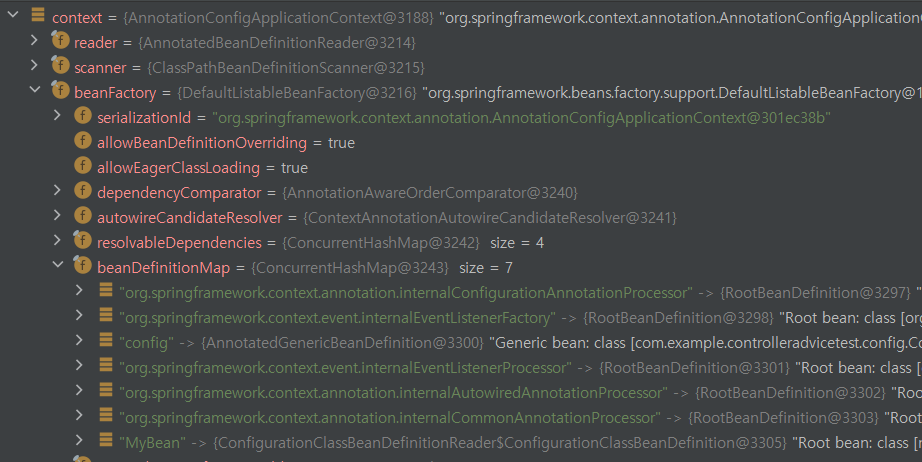
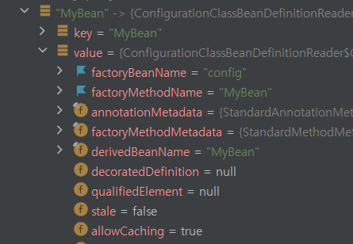
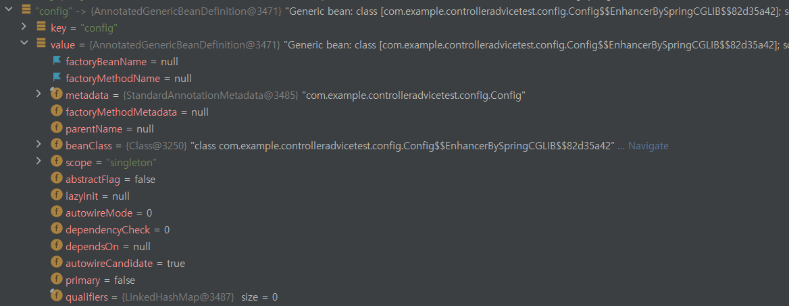
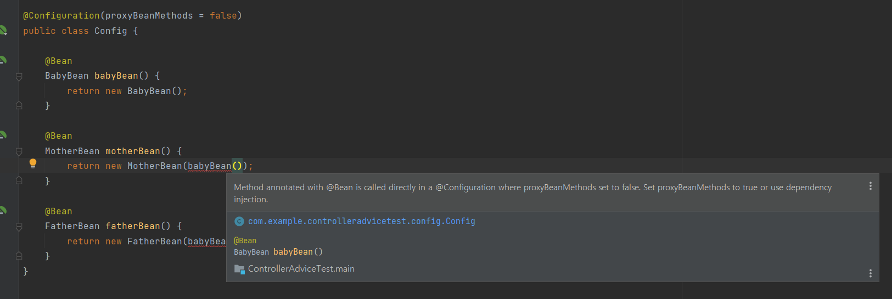
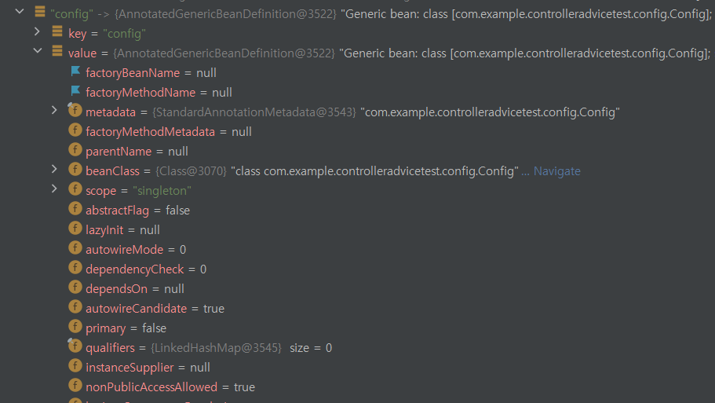

## 어노테이션을 사용해서 빈을 생성하는 방법

어노테이션을 사용해서 빈을 생성하는 방법은 크게 두 가지가 있다.

- `@Configuration`과 `@Bean`을 사용해 빈 설정 정보 클래스 생성
- `@Component`와 이를 상속한 `@Repository`, `@Controller` 어노테이션등을 사용해 자바 컴포넌트 생성

오늘은 첫 번째 방법인 `@Configuration`을 알아보자.

## @Configuration이란?

[Spring 공식문서 - Configuration](https://docs.spring.io/spring-framework/docs/current/javadoc-api/org/springframework/context/annotation/Configuration.html)

> Indicates that a class declares one or more [`@Bean`](https://docs.spring.io/spring-framework/docs/current/javadoc-api/org/springframework/context/annotation/Bean.html) methods and may be processed by the Spring container to generate bean definitions and service requests for those beans at runtime

- `@Configuration` 어노테이션을 사용하면, 하나 이상의 `@Bean`메서드가 포함된 빈 설정용 클래스를 만들 수 있다.
- 스프링 컨테이너는 `@Bean` 메서드를 통해 빈을 생성한다.

```
+ 참고

여기서 스프링 컨테이너란, 빈에 대한 정보를 읽어 빈을 생성, 관리하며 빈들간의 의존성 주입을 수행하는 ApplicationContext를 의미한다.
스프링 컨테이너 = IoC 컨테이너 = ApplicationContext = BeanFactory 모두 넓게 같은 의미로 사용된다. (by 토비 스프링)

* BeanFactory ⊂ ApplicationContext ⊂ IoC 컨테이너 ⊂ 스프링 컨테이너
순으로 포함 개념이라고 봐도 무방하다.

편의상 아래에서 부터는 ApplicationContext로 통용해 말하겠다.

```

### @Configuration 사용 예시

```java
@Configuration
public class Config {

    @Bean
    MyBean MyBean() {
        return new MyBean();
    }
}
```

`ApplicationContext`는 `@Configuration`이 붙은 클래스 내부에서 `@Bean`이 붙은 메서드들을 찾는다.

- `@Bean` 이 붙은 메서드들은 자바 객체를 반환하는 메서드이다.

- 반환된 자바 객체는 스프링 컨테이너에 빈으로 등록된다.

- 빈의 이름은 `@Bean`이 붙은 메서드 이름이 된다. (이 코드의 경우 메서드명과 같은 `MyBean` 빈이 생성된다.)
- 빈 타입은 메서드가 반환하는 자바 객체가 된다.

## 등록한 빈 가져오기 - getBean()

앞서 말했듯이, `ApplicationContext`는 빈에 대한 정보(@Configuration 클래스)를 전부 읽어서 등록한다.

`ApplicationContext`의 `getBean()`메서드를 통해 빈에 대한 정보를 가져올 수 있다. (정확히는 `ApplicationContext`인터페이스를 구현한 클래스를 의미한다.)

`getBean()`에 들어가는 인자는 다음과 같다.

- `getBean(빈의 이름, 빈의 타입);`

### getBean() 사용 예시

```java
// 빈으로 등록할 클래스

public class MyBean {
    private final String name = "MyBean 입니다.";

    public String getName() {
        return name;
    }
}
```

```java
// @Configuration을 사용해서 ApplicationContext에 빈 설정 정보 제공

@Configuration
public class Config {

    @Bean
    MyBean MyBean() {
        return new MyBean();
    }
}
```

```java
// getBean()을 사용해서 빈 객체를 불러올 수 있음

@SpringBootTest
public class ConfigTest {
    @Autowired
    ApplicationContext applicationContext;

    @Test
    public void test(){
        MyBean bean = applicationContext.getBean("MyBean", MyBean.class);
        System.out.println(bean.getName());
    }
}
```

```
// 실행 결과
MyBean 입니다.
```

## 빈 객체의 `@Bean`메서드와 `@Configuration` 정보 확인 - `factoryBeanName`, `factoryMethodName`

빈 객체의 `factoryBeanName`, `factoryMethodName` 필드를 통해 `@Bean` 메서드 정보와 `@Configuration` 빈 객체정보를 확인할 수 있다.

- `factoryMethodName` : 해당 빈 객체를 생성한 `@Bean` 메서드의 이름
- `factoryBeanName` : 해당 빈 객체를 등록한 `@Configuration` 빈 객체의 이름

#### context -> beanFactory



- `ApplicationContext`는 `beanFactory` 객체를 가지고 있다. `beanFactory`의 `beanDefinitionMap`에는 `ApplicationContext`가 등록한 모든 빈에 대한 정보가 들어있다.

#### `@Bean` 메서드로 등록한 빈의 필드



- `factoryBeanName`, `factoryMethodName` 필드에 `MyBean`을 생성한 `@Bean`메서드의 이름과, `@Configuration` 빈 객체의 이름이 들어가있는 것을 볼 수 있다.

#### `@Bean` 메서드로 등록하지 않은 빈의 필드



- 빈 `config`는 `@Bean`메서드에 의해 생성된 빈이 아니기에 `factoryBeanName`, `factoryMethodName` 가 비어있는 것을 볼 수 있다.

## Configuration의 속성

```java
@Target(ElementType.TYPE)
@Retention(RetentionPolicy.RUNTIME)
@Documented
@Component
public @interface Configuration {

	@AliasFor(annotation = Component.class)
	String value() default "";

	boolean proxyBeanMethods() default true;

}

```

### value

`@Configuration`이 붙은 클래스의 빈 이름 설정

설정하지 않으면 자동으로 클래스 이름이 빈의 이름이 된다.

- 한 가지 주의할 점은 앞글자가 소문자로 등록된다. 클래스 이름은 `Config`이지만, 등록된 빈의 이름은 `config`인 것을 볼 수 있다.


### proxyBeanMethods

빈에 대한 프록시 객체를 생성할 지 여부를 결정한다.

- 디폴트값은 true이다. 빈 프록시 객체 생성이 디폴트라는 뜻

#### proxyBeanMethods가 true일 때

사용 예시를 위해 빈으로 등록할 세 개의 클래스를 생성했다. (`BabyBean`, `MotherBean`, `FatherBean`)

세 클래스는 모두 생성이 될 때, `BabyBean`을 출력한다.

```java
public class BabyBean {

    public BabyBean(){
        System.out.println("애기빈 : " + this);
    }

}
```

```java
public class MotherBean {

    public MotherBean(BabyBean babyBean) {
        System.out.println("엄마빈 : " + babyBean);
    }

}
```

```java
public class FatherBean {

    public FatherBean(BabyBean babyBean) {
        System.out.println("아빠빈 : " + babyBean);
    }

}
```

<br/>

세 클래스를 `@Configuration`을 사용해 빈으로 등록해보자.

```java
@Configuration
public class Config {

    @Bean
    BabyBean babyBean() {
        return new BabyBean();
    }

    @Bean
    MotherBean motherBean() {
        return new MotherBean(babyBean());
    }

    @Bean
    FatherBean fatherBean() {
        return new FatherBean(babyBean());
    }
}
```

```
// 실행 결과

애기빈 : com.example.controlleradvicetest.config.BabyBean@2d0566ba
엄마빈 : com.example.controlleradvicetest.config.BabyBean@2d0566ba
아빠빈 : com.example.controlleradvicetest.config.BabyBean@2d0566ba
```

- 실행 결과를 보면, `FatherBean`, `MotherBean`, `BabyBean` 생성자로 출력된 `BabyBean` 객체가 전부 같은 것을 확인할 수 있다.
- 이는 `BabyBean` 객체는 한 번 생성된다는 것을 의미한다. (싱글톤)

#### proxyBeanMethods를 false일 때



- 동일한 `@Configuration` 클래스내에서는 `proxyBeanMethod`가 false이면 아예 할당이 안되는 것을 볼 수 있다.

같은 `@Configuration` 안에 선언되어 있으면 프록시 객체로 먼저 할당을 하나보다...

아예 에러가 날 줄은 몰랐는데 당황스럽다... `@Cofiguration` 클래스를 두 개로 분리해서 의존성을 주입해주면 작동하지 않을까?

```java
@Configuration(proxyBeanMethods = false) // babyBean 프록시 객체를 생성하지 않는 @Configuration 클래스
public class Config {

    @Bean
    BabyBean babyBean() {
        return new BabyBean();
    }
}
```

```java
@Configuration
public class ParentConfig {
    @Autowired
    Config config; // babyBean을 생성하는 @Configuration 빈 객체를 주입받는다

    @Bean
    MotherBean motherBean() {
        return new MotherBean(config.babyBean()); // babyBean 주입
    }

    @Bean
    FatherBean fatherBean() {
        return new FatherBean(config.babyBean()); // babyBean 주입
    }
}

```

```java
public class ConfigTest {

    @Test
    public void test(){
        AnnotationConfigApplicationContext context = new AnnotationConfigApplicationContext(Config.class, ParentConfig.class);
        BabyBean babyBean = context.getBean("babyBean", BabyBean.class);
        System.out.println(babyBean);

        MotherBean motherBean = context.getBean("motherBean", MotherBean.class);
        FatherBean fatherBean = context.getBean("fatherBean", FatherBean.class);
    }
}
```

```
// 실행 결과

애기빈 : com.example.controlleradvicetest.config.BabyBean@c8b96ec

애기빈 : com.example.controlleradvicetest.config.BabyBean@2fa7ae9
엄마빈 : com.example.controlleradvicetest.config.BabyBean@2fa7ae9

애기빈 : com.example.controlleradvicetest.config.BabyBean@7577b641
아빠빈 : com.example.controlleradvicetest.config.BabyBean@7577b641
```

- `proxyBeanMethods = false`로 설정하니, `babyBean`이 싱글톤으로 생성되지 않는 것을 볼 수 있다.
- `motherBean`과 `fatherBean`에 `babyBean`을 주입할 때, `config`에서 새로운 `babyBean`객체를 생성해 주입해주는 것을 알 수 있다.

### proxyBeanMethods와 싱글톤 타입의 연관 관계

`proxyBeanMethods = false`로 하면 `@Bean`메서드로 생성한 빈이 싱글톤으로 생성되지 않는다. 프록시 객체와 싱글톤이 무슨 연관이 있길래 그러는 걸까?

#### `proxyBeanMethods = true`일 때의 config빈의 상태


#### `proxyBeanMethods = false`일 때의 config빈의 상태



두 `config`의 차이가 보이는가? 프록시 객체로 생성한 빈의 클래스 이름을 보면 `$$EnhancerBySpringCGLIB&&` 라는 게 추가된 것을 알 수 있다.

### CGLIB?

> cglib is a powerful, high performance and quality Code Generation Library. It is used to extend Java classes and implements interfaces at runtime.

> Byte Code Generation Library is high level API to generate and transform JAVA byte code. It is used by AOP, testing, data access frameworks to generate dynamic proxy objects and intercept field access.

바이트 코드를 가지고 프록시 객체를 만들어주는 라이브러리이. 런타임에 **자바 클래스를 extend**하고 인터페이스를 구현하는데 사용한다.

동적 프록시 객체를 만든다. 바이트 코드를 가지고 프록시 객체를 만들어주는 라이브러리라고 알고 넘어가자!

즉, `proxyBeanMethods`가 true인 상태에서 사용되는 `config` 빈은 우리가 직접 생성한 객체가 아니라 `CGLIB` 라이브러리에서 생성해준 프록시 객체임을 의미한다.

### 프록시 객체를 사용해서 싱글톤으로 관리되는 빈

프록시 객체로 어떻게 싱글톤타입의 빈을 만드는 걸까?

스프링은 `CGLIB`라이브러리를 사용해 `Configuration` 클래스를 그대로 사용하지 않고, `Configuration`을 상속한 클래스를 새로 만들어서 사용한다. (프록시 객체) 기존 클래스를 상속해야하므로, `Configuration`은 final 클래스로 생성할 수 없다.

```java
@Configuration
public class Config { // 정의한 Configuration 클래스

    @Bean
    MyBean MyBean() {
        return new MyBean();
    }
}
```

```java
public class ConfigExt extends Config { // 실제로 빈을 반환하는데 사용되는 클래스
	private Map<String, Object> beans = ...;

    @Override
    MyBean MyBean() {
        if(!beans.containsKey("MyBean")) {
            beans.pus("MyBean", super.MyBean());
        }

        return (MyBean) beans.get("MyBean")
    }
}
```

물론 실제 코드는 이보다 더욱 복잡하다고 한다. 예시용으로 참고만 하자 (스프링5 프로그래밍 입문 - 최범균)

### ApplicationContext에 Configuration 등록

스프링이 `@Configuration`이 붙은 클래스들을 찾기 위해선, 스프링 컨테이너를 초기화해야한다. SpringBoot Context가 로딩되는 환경이라면, 개발자가 IoC컨테이너를 초기화해줄 필요가 없지만, SpringBoot Context가 로드 되지 않는 환경에서 빈을 테스트 해보고 싶다면, ApplicationContext 를 직접 생성해서 `@Configuration`클래스를 등록해줘야 한다.

```java
//@SpringBootTest <- SpringBoot Context 환경 로딩 X
public class ConfigTest {

    @Test
    public void test(){
        AnnotationConfigApplicationContext context = new AnnotationConfigApplicationContext(Config.class);

        MyBean bean1 = context.getBean("MyBean", MyBean.class);
        MyBean bean2 = context.getBean("MyBean", MyBean.class);
        System.out.println(bean1);
        System.out.println(bean2);
    }
}

```

여러 개의 `Configuration` 클래스를 등록하고 싶다면, `ApplicationContext`의 생성자로 인자를 추가하면 된다.

```java
AnnotationConfigApplicationContext context = new AnnotationConfigApplicationContext(Config1.class, Config2.class);
```

\+ 참고용

여러 `ApplicationContext`중 `AnnotationConfigApplicationContext`를 사용한 이유

[Spring 공식문서 - Configuration](https://docs.spring.io/spring-framework/docs/current/javadoc-api/org/springframework/context/annotation/Configuration.html)

> `@Configuration` classes are typically bootstrapped using either [`AnnotationConfigApplicationContext`](https://docs.spring.io/spring-framework/docs/current/javadoc-api/org/springframework/context/annotation/AnnotationConfigApplicationContext.html) or its web-capable variant, [`AnnotationConfigWebApplicationContext`](https://docs.spring.io/spring-framework/docs/current/javadoc-api/org/springframework/web/context/support/AnnotationConfigWebApplicationContext.html).

공식 문서를 보면 `@Configuration` 클래스들은 보통 `AnnotationConfigApplicationContext`나 `AnnotationConfigWebApplicationContext`에 적용된다고 한다.

**AnnotationConfigApplicationContext이 뭐길래 사용하는데?**

클래스 이름에서 알 수 있듯이 어노테이션 기반으로 구성 정보를 제공하는 ApplicationContext라고 한다. (Xml로 빈 정보를 구성하는 경우 다른 ApplicationContext를 사용한다.)

- `@Configuration`과 `@Component` 가 붙여진 클래스들을 읽어온다.

[Spring 공식문서 - AnnotationConfigApplicationContext](https://docs.spring.io/spring-framework/docs/current/javadoc-api/org/springframework/context/annotation/AnnotationConfigApplicationContext.html)

> In case of multiple `@Configuration` classes, [`@Bean`](https://docs.spring.io/spring-framework/docs/current/javadoc-api/org/springframework/context/annotation/Bean.html) methods defined in later classes will override those defined in earlier classes.

여러 개의 `@Configuration` 클래스가 있을 경우, 나중에 등록되는 것으로 오버라이딩 된다고 한다.

### @Configuration vs @Component

`@Configuration`은 내부적으로 `@Component`를 상속받고 있다.

```java
@Target(ElementType.TYPE)
@Retention(RetentionPolicy.RUNTIME)
@Documented
@Component
public @interface Configuration {
    ...
}
```

`@Component`를 사용해서 원하는 클래스를 빈으로 등록할 수 있는데 `@Configuration`이 왜 필요한 걸까?

포인트는 `@Component`는 구현한 클래스 위에 선언해야 하지만, `@Configuration`은 `@Bean`메서드 내부에서 생성한 객체를 빈으로 등록할 수 있다는 점이다.

- 여러 개를 동시에 빈으로 등록하기 vs 하나를 빈으로 등록하기

외부에서 구현한 클래스를 빈으로 등록하고 싶은데, 이 클래스가 read-only로 쓰였다면 `@Component`를 클래스 위에 선언할 수 없다. `@Configuration`을 사용하면, 메서드 내부에서 해당 클래스를 호출해 반환함으로써 빈으로 등록할 수 있다.

또, 한 곳에서 관리하고 싶은 빈들의 경우, 특정 패키지내부에 있는 빈들만 스프링 컨테이너에 등록하고 싶은 경우는 `@Configuration`을 사용하면 편리하게 관리할 수 있다.
