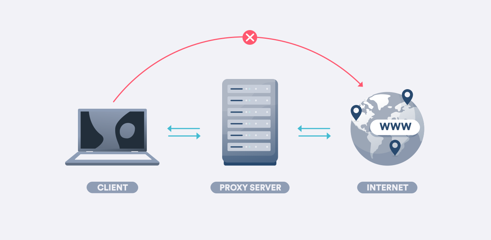
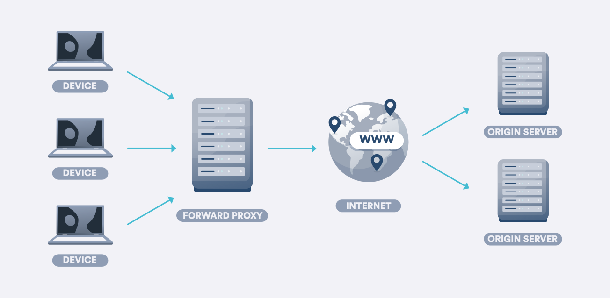
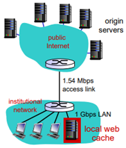
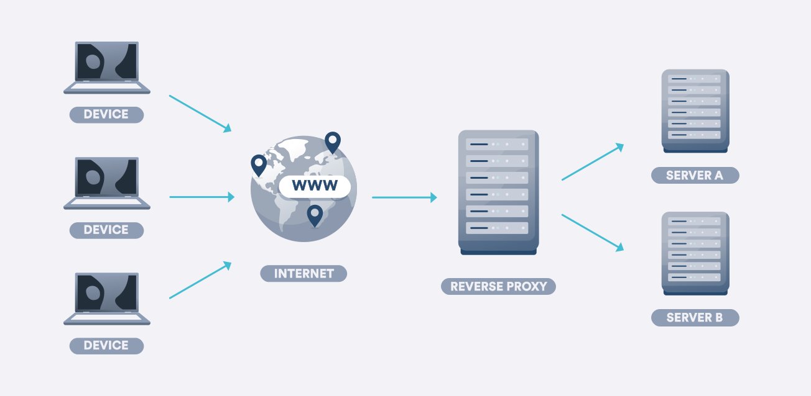

Nginx 로드밸런싱 설정을 하면서 proxy_pass라는 것을 알게 되었다. 서버에 요청이 들어올 때, 요청을 받은 서버가 처리하지 않고 다른 서버에게 위임할 수 있는 방식이라고 이해했다. 로드밸런싱외에 프록시 서버를 사용해서 어떤 이점을 얻을 수 있는지 궁금해졌다.

프록시에 대해 공부하면서 프록시 서버가 순방향 프록시와 역방향 프록시로 나뉜다는 것을 주워들었다. 두 프록시는 어떤 차이가 있는지 간단하게 알아보자.

## 프록시서버란?

프록시 서버는 말 그대로 중개자 역할을 하는 서버이다.

클라이언트와 웹서버 사이에 존재하며, 클라이언트의 요청을 대신 웹서버에게 전달하고, 웹서버의 응답을 대신 클라이언트에게 전달한다. 클라이언트와 웹서버는 사이에 프록시 서버를 두고 간접적으로 소통하게 된다.

왜 그래야하는 걸까? 프록시 서버를 두면 어떤 점이 좋은 걸까? 아래에서 살펴보자.

## 순방향 프록시(Forward Proxy)

### 캐싱

- 서버 트래픽 감소

순방향 프록시는 프록시 서버에서 클라이언트 방향으로 데이터를 전달한다.

순방향 프록시는 클라이언트와 웹서버 사이에 존재하므로, 웹서버보다 먼저 클라이언트의 요청을 받는다.

프록시 서버는 데이터를 캐싱해둘 수 있는데, 요청한 데이터가 캐시에 있으면 웹서버를 거치지않고 바로 클라이언트에게 데이터를 전달할 수 있다. 캐싱을 통해 웹 서버로 들어오는 트래픽을 감소시킬 수 있다.

- response time 감소

프록시 서버가 웹서버보다 클라이언트와 지리적으로 가까운 곳에 위치한다면, respose time을 감소시킬 수 있다.

### 보안 & IP 우회

클라이언트 대신 프록시 서버가 웹서버에게 요청을 보내게 되므로 클라이언트의 IP 주소를 웹서버에게 숨길 수 있다. 웹 서버는 클라이언트의 IP를 모르고 프록시 서버의 IP로 요청을 받게된다. 클라이언트는 프록시 서버를 사용해서 IP를 우회할 수 있다.

### 인터넷 사용 제한

순방향 프록시는 클라이언트가 인터넷에 접근하기 전에 먼저 요청을 받는다. 그러므로 특정 URL에 접근하지 못하도록 인터넷 사용 권한을 설정할 수도 있다.

학교 네트워크에서 특정 URL에 접근하지 못하게 막아두는 것또한 순방향 프록시를 사용한 예시이다.

## 역방향 프록시(Reverse Proxy)

### 로드밸런싱 + GSLB

- 웹 서버 부하 분산

역방향 프록시는 프록시 서버에서 웹서버 방향으로 데이터를 전달한다.

즉, 웹서버가 받은 요청을 다른 서버에게 넘길 수 있다. 이는 여러 개의 서버가 존재하거나(채팅 서버, 금전 처리 서버 등) 로드 밸런싱을 할 때 유용하게 사용할 수 있다. 클라이언트는 하나의 IP주소(프록시 서버)에 요청을 보내는 것 같지만, 역방향 프록시를 사용해서 다른 서버에게 요청을 위임할 수 있다.

- response time 감소

여러 개의 지역에 웹 서버가 존재할 때, 역방향 프록시가 클라이언트와 지리적으로 가장 가까운 웹 서버에게 요청을 전달할 수 있다. 응답하는데 걸리는 시간이 감소한다.

- 서버 장애 대응

하나의 웹 서버에서 장애가 발생해도 로드밸런싱중이기에 다른 웹 서버로 요청을 보내서 처리가 가능하다.

- 무중단 배포

로드밸런싱을 할 수 있으므로, 무중단 배포가 가능해진다.

### 공격 방어

역방향 프록시는 인터넷과 웹 서버 사이에 존재하므로, 공격자는 웹 서버의 IP주소를 알 수 없다. 때문에 DDoS같은 공격을 방어할 수 있다. (프록시 서버는 IP주소는 공개되므로 DDoS 공격을 막을 수 없다.)

### 간편한 SSL 적용

역방향 프록시에만 SSL 인증서를 발급받아 적용시키면 웹 서버에서는 SSL적용을 하지 않아도 된다. 프록시 서버에만 SSL 설정을 하면 되므로 간편하다.

### 캐싱

역방향 프록시도 순방향 프록시와 마찬가지로 캐싱을 할 수 있다. 실제 웹서버에 접근하기 전에 역방향 프록시에서 캐싱한 데이터를 돌려주는 것이 가능하다.

## 순방향 프록시와 역방향 프록시의 차이

가장 큰 차이점은 프록시 서버가 있는 위치가 다르다는 것이다. 순방향 프록시는 클라이언트와 인터넷 사이에 존재하고, 역방향 프록시는 인터넷과 웹 서버 사이에 존재한다.

순방향 프록시는 클라이언트가 속해있는 private network 에 위치할 수도 있고 온라인에 위치할 수도 있다. 순방향 프록시는 클라이언트가 웹 사이트(인터넷)과 직접 통신하지 않는 것을 보장하고, 역방향 프록시는 클라이언트가 웹 서버와 직접 통신하지 않는 것을 보장한다. 때문에 보안이 적용되는 대상에서 차이가 있다.

## 참고

- https://oxylabs.io/blog/reverse-proxy-vs-forward-proxy

- https://jcdgods.tistory.com/322

- https://www.ibm.com/docs/en/was-nd/8.5.5?topic=caching-overview-proxy-server

- https://inyongs.tistory.com/59

- https://surfshark.com/ko/blog/proxy-server

- https://www.cloudflare.com/ko-kr/learning/cdn/glossary/reverse-proxy/
