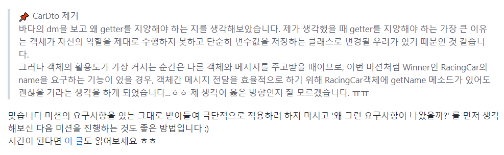

## 자동차 경주 게임을 만들어보자!

대망의 우테코 첫 번째 미션은 페어와 함께하는 `자동차 경주 게임` 만들기였다! (+ 연극...ㅎ) <br/>

```
경주할 자동차 이름을 입력하세요(이름은 쉼표(,)를 기준으로 구분).
pobi,crong,honux
시도할 회수는 몇회인가요?
3

실행 결과
pobi : -
crong : -
honux : -

pobi : --
crong : -
honux : --

pobi : ---
crong : --
honux : ---

pobi : ----
crong : ---
honux : ----

pobi, honux가 최종 우승했습니다.

```

🚀 [자동차 경주 게임 PR링크](https://github.com/woowacourse/java-racingcar/pull/516)

<br/>

이번 포스팅에서는 자동차 경주 게임을 만들면서 느꼈던 점을 정리해보려고 한다!

## getter 사용을 지양하자?

`getter`를 지양하자! 우테코에 들어왔다면 모두 들어본 말일 것이다. <br/>

`getter`는 왜 지양해야할까? 객체가 `getter`를 사용해 단순히 값을 반환한다면, 그건 객체가 아니라 여러 개의 변수를 저장하는 클래스에 불과할 것 이다. 객체는 자신이 지닌 값을 활용하고, 반환값으로 그 활용 결과를 내보내야 한다. <br/>

그렇기에 이번 자동차 경주 게임에서도 `getter`를 사용하지 않기로 해보았다.<br/>

### RacingCar

레이싱카는 `name`과 `position`을 변수로 지닌다. 지금부터 `getName`과 `getPosition`을 쓰지않기 위해 고군분투한 여정을 써보겠다...

<br/>

### getPosition 아웃!

자동차 경주 게임은 1. 라운드마다 각 차들의 position을 표기하고, 2. position이 가장 큰 위너를 표시해야하는 요구사항이 존재한다. <br/>

```java
public class RacingCar implements Comparable<RacingCar> {
    private static final String DESCRIPTION_DELIMITER = " : ";
    private static final String POSITION_BAR = "-";

    public String getDesc() {
        return name + DESCRIPTION_DELIMITER + POSITION_BAR.repeat(position);
    }

    @Override
    public int compareTo(RacingCar o) {
        return this.position - o.position;
    }
}
```

- 라운드마다 각 차들의 position을 표시해주기 위해 `getDesc` 메소드르 만들어 출력 문구를 반환했다.

- 위너를 구하기 위해 `compareTo`메소드를 사용해 레이싱카들을 비교했다.

<br/>

와아~ `getPosition`없이 구현에 성공했다! 이제 `getName`도 없애보자~

### getName 아웃?

자동차 경주 게임은 위너들의 이름을 출력하는 기능이 존재한다. 우선 위에서 구현한 compareTo메소드를 활용해 가장 position이 큰 자동차를 구할 수 있다.

```java
public class RacingCars {
    private final List<RacingCar> racingCars;

    public RacingCar findFirstCar(){
        return racingCars.stream.max(RacingCar::compareTo).get();
    }
}
```

자, 이제 일등인 자동차를 구했으니 이름을 출력하면 된다! 오잉? 근데... `getName`없이 `RacingCar`에서 name을 뽑아낼 수 있을까?

여러 방법을 고민하다가 `RacingCar` 에서 `toDto`메소드를 만들어서 반환했다.

### 정적 팩토리 메소드를 사용해서 DTO를 구현

리뷰어로부터 `toDto` 메소드 대신 정적 팩토리 메소드를 사용해서 DTO 클래스를 생성하는 것을 권유해주셨다.

```java
public class RacingCarDto {

    ...

	public static RacingCarDto from(RacingCar racingCar){
        this.name = racingCar.getName();
        this.position = racingCar.getPostion();
    }

}
```

### 잠깐!!!

여기서 이상한 점이 생긴다. 나는 `getter`를 사용하지 않기 위해 `DTO`클래스를 생성했는데 정적 팩토리 메소드를 사용해서 `DTO`를 생성할 경우, `RacingCar`객체에 `getter`가 존재해야하는 모순이 발생한다.

### 리뷰어님... 이거 이상해요.😭

결국 리뷰어님에게 이 부분에 대한 질문을 드렸고, 리뷰어님에게 `getter`를 왜 지양해야하는지?를 다시 생각해보라는 조언을 받았다. <br/>

`getter`... 왜 있어야하는걸까? 는 이미 앞에서 말했다.

> `getter`는 왜 지양해야할까? 객체가 `getter`를 사용해 단순히 값을 반환한다면, 그건 객체가 아니라 여러 개의 변수를 저장하는 클래스에 불과할 것 이다. 객체는 자신이 지닌 값을 활용하고, 반환값으로 그 활용 결과를 내보내야 한다.

위처럼 `getter`를 사용했을 때의 장점은 명확하다. 그러나 객체의 활용도가 가장 커지는 순간은 다른 객체와 메시지를 주고받을 때이므로, 이번 미션처럼 우승한 자동차의 name을 요구하는 기능이 있을 경우, 객체간 메시지 전달을 효율적으로 하기 위해 RacingCar객체에 getName 메소드가 있어도 괜찮을 거라는 생각을 하게 되었다...

<br/>



리뷰어님이 추천해주신 글을 보면 다음과 같이 적혀있다.

```
## getter를 무조건 사용하지 말라는 말은 아니다.

당연히 getter를 무조건 사용하지 않고는 기능을 구현하기 힘들것이다. 출력을 위한 값 등 순수 값 프로퍼티를 가져오기 위해서라면 어느정도 getter는 허용된다. 그러나, Collection 인터페이스를 사용하는 경우 외부에서 getter메서드로 얻은 값을 통해 상태값을 변경할 수 있다.
```

`getter`를 사용하면 좋다는 것에만 꽂혀서 오히려 오버 프로그래밍을 하고 있었다... 남이 좋다고 하는거에 무조건 수긍하지 말고, 현재 내가 구현해야하는 요구사항을 보고 내가 직접 판단을 내려보도록 노력하자! (줏대있게 살자!)

## 확장성 집착 X! 테스트 집착 X!

확장성에 집착하던 나는 페어인 오잉에게 계속... 인터페이스 분리하자고 하고... 전략패턴하자고 하면서... 이것저것 졸랐다. 이번에... 확장성에 크게 집착하지말자는 교훈을 얻었다^^... <br/>

우테코를 하면서 비용적으로 효율적인 코드를 작성하는 것이 좋다는 것을 배웠다. <br/>

물론 DTO나 여러 디자인 패턴을 활용해서 구현하면 확장성이 늘어난 것은 사실이다. 그러나 이 프로젝트가 얼마나 큰 프로젝트인지, 여기 들어가는 내 노동량...^^ 등 전부 고려해서 비용적인 면을 고려하는 것도 중요한 것 같다. <br/>

테스트도 마찬가지다!!! 그 동안 테스트 집착녀마냥 모든 기능을 완벽하게 테스트하려고 했는데 테스트가 가능한 부분만 작은 단위로 나눠 단위테스트를 진행하는 것도 좋은 방법이라는걸 배웠다.
