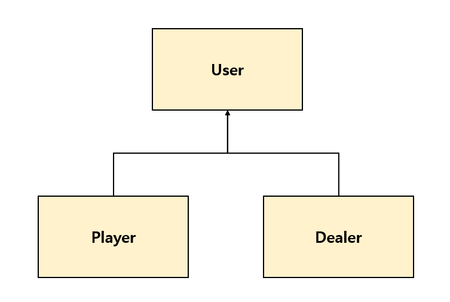
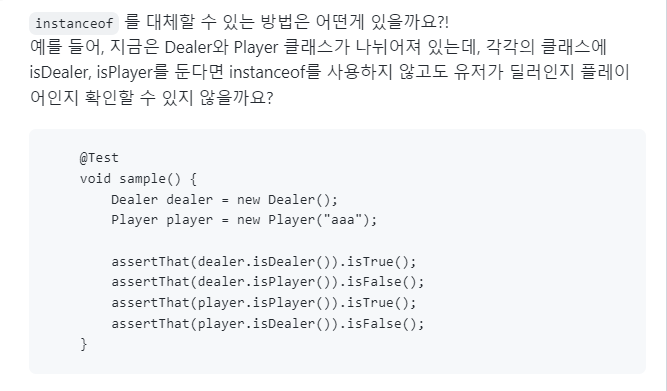

## 하위 객체의 타입을 알기위해 instance 사용

블랙잭 미션을 하면서 게임에 참여하는 유저들을 나타내는 `User` 추상 클래스를 만들고 이를 상속한 `Player`와 `Dealer`클래스를 생성했다.<br/>



`User`의 일급컬렉션이 `Users`에서 `Player`인 `User`들만 리스트로 가져오기위해 아래와 같이 `getPlayers()`메소드를 작성했다. 

```java
public class Users { 
    private final List<User> users;
    
    public List<Player> getPlayers() {
            return users.stream()
                .filter(user -> user instanceof Player)
                .map(user -> (Player) user)
            	.collect(Collectors.toUnmodifiableList());
    }
    
    public Dealer getDealer() {
        User dealer = users.stream()
            .filter(user -> user instanceof Dealer)
            .findAny()
            .orElseThrow(IllegalArgumentException::new);
        return (Dealer) dealer;
    }
```

> `instanceof`를 사용해 특정 타입의 객체를 필터링을 했다.


## instanceof 사용을 지양하라?

위 코드에 리뷰어님이 코멘트를 남겨주셨다!



왜 `instanceof` 를 대체해야하는 것일까? `instanceof` 대신 `isDealer()`, `isPlayer()` 추상메소드를 사용했을 때 얻는 이점은 무엇일까? 그 답을 찾아보자!


## instanceof를 지양해야 하는 이유

### 📌 런타임 성능

추상메소드를 가지고 다형성을 사용한 방식과, `instanceof`를 사용한 방식 모두 객체의 타입을 추론할 수 있다. 그렇다면 각 방식의 추론 로직은 어떻게 동작할까? <br/>

다형성을 사용할 경우, 컴파일러가 런타임시 객체 타입에 따라 올바른 로직을 수행할 수 있게 가상 메소드를 호출한다. 그러나 `instanceof`는 컴파일 타임에 일치하는 타입을 찾을때까지 모든 객체의 하위 타입을 돌며 검사를 수행한다. 하위객체가 많으면 많을 수록 더 긴 시간이 소요된다. <br/>

* instanceof에 대한 포스팅을 찾다가 [instanceof의 사용을 지양하자](https://tecoble.techcourse.co.kr/post/2021-04-26-instanceof/)를 보게 되었는데, 해당 포스팅에서`instanceof`를 사용했을 때와 다형성을 사용했을 때의 수행시간을 비교한 코드를 보게되었다ㅎㅎ 나도 궁금해서 따라해보았다...

```java
@Test
    void test() {
        User dealer = new Dealer();
        long start = 0;
        long end = 0;

        start = System.nanoTime();
        assertTrue(dealer instanceof Dealer);
        end = System.nanoTime();
        System.out.println("instanceof: " + (end-start));

        start = System.nanoTime();
        assertTrue(dealer.isDealer());
        end = System.nanoTime();
        System.out.println("다형성: " + (end-start));
    }
```

```
// 실행결과
instanceof: 6264800
다형성: 7100
```

다형성을 사용한 방법이 더 빠른 것을 볼 수 있다!


### 📌 캡슐화가 깨짐

객체는 메세지를 주고받으며 소통을 한다. 외부에서는 객체에 대한 정보를 알 필요가 없고 단순히 객체가 어떤 역할을 하는지만 알고있으면 된다. <br/>

`instanceof`의 경우 객체간 로직을 주고받는 형태가 아니라, `Users`에서 직접 객체의 타입을 알아내기 때문에 객체의 정보가 드러난다. `User`를 상속한 객체에게 딜러인지, 플레이어인지 판단하는 책임을 부여해서, 로직으로 소통하는 것이 더 객체지향적인 방법이다. <br/>


### 📌 단일 책임 원칙 위배

`instanceof`는 객체의 타입을 알아내서 그에 맞는 로직을 수행하기 위해 사용된다.  이는 `instanceof`를 호출하는 클래스에서 하위 객체에 따른 로직을 전부 알고있어야하는 것이 된다. 하나의 객체가 각 타입에 따른 로직을 알고있는 것은 단일 책임 원칙에 위배된다. 각 타입에게 책임을 부여하는 것이 더 객체지향적인 방법이다.


## 최종 코드

```java
public class Users {
    private final Dealer dealer;
    private final Players players;
    
    public List<Player> getPlayers() {
        return players.getPlayers();
    }

    public Dealer getDealer() {
        return dealer;
    }
}
```

최종코드는 위와 같다. `instanceof`를 `isPlayer()`, `isDealer()`와 같이 추상메소드를 활용한 방법으로 변경해도 결국 `Users` 에서 타입 체크를 수행하게 된다. <br/>

타입 체크를 하는 로직이 있다는 점에서 단일 책임 원칙에 위배되고, 각 타입의 객체를 get해오기위해 `Users`가 매번 필터링을 수행해야하는 단점이 있었다.<br/>

이 부분에 대해서도 리뷰어님과 얘기해봤는데 `List<User>`를 아예 분리하는 것을 추천해주셨고 나또한 이 방식이 타입 체크를 수행하는 기존의 코드보다 더 좋다고 생각해 변경했다.
