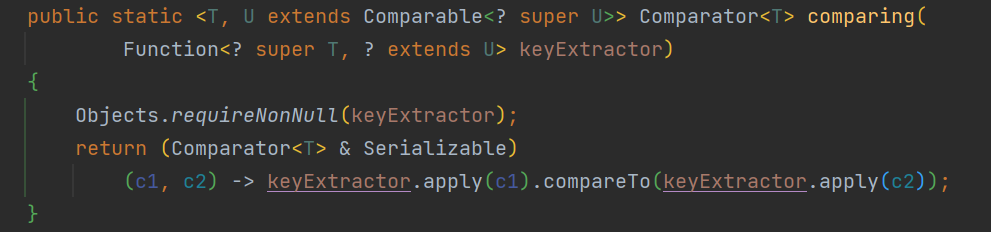
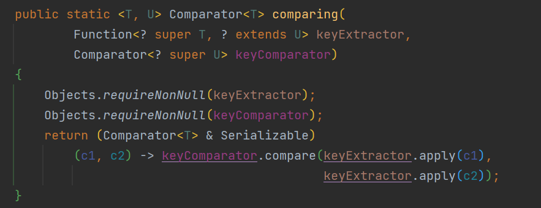

## Comparable & Comparator

이전에 [Java - TreeSet과 Comparable&Comparator](https://blog.hongo.app/comparable/)에서 `Comparable` 과  `Comparator`의 사용 방법에 대해 간략하게 알아보았다. 이번 포스팅에서 `Comparator`을 활용 방법을 더 알아보도록 하자.

### 📌 Money를 큰 순으로 정렬

임의로 생성한 `Money` 클래스가 있다고 가정하자. `List<Money>`를 정렬하고 싶다면 어떻게 해야 할까? `Comaprable`과 `Comparator`를 사용해볼 수 있다.

<br/>

#### Comparable

```java
public class Money implements Comparable<Money> {
    private final int money;

    public Money(final int value) {
        this.value = value;
    }

    public int money() {
        return money;
    }
    
    @Override
    public int compareTo(Money o) {
        return o.money - this.money;
    }
}
```

> `compareTo`
>
> * 음수가 리턴되면, this가 더 작은 것으로 판단
> * 0이 리턴되면, 순서가 같은 것으로 판단
> * 양수가 리턴되면 this가 더 큰 것으로 판단

<br/>

#### Comparator

```java
Comparator<Money> comparator = new Comparator<Money>() {
    @Override
    public int compare(Money a, Money b) {
        return b.money() - a.money();
    }
};
```

>`compare`
>
>* 음수가 리턴되면, 첫 번째 인자가 더 작은 것으로 판단
>* 0이 리턴되면, 순서가 같은 것으로 판단
>* 양수가 리턴되면 첫 번째 인자가 더 큰 것으로 판단

<br/>

#### 람다식 사용

`sort` 메소드에 람다식으로 `Comparator`를 바로 정의할 수도 있다.

```java
List<Money> wallet = new ArrayList<>(List.of(m1, m2, m3));
wallet.sort((a,b) -> (b.getValue() - a.getValue()));
```


## Comparator의 주요 함수

| 함수명                                 | 설명                               |
| -------------------------------------- | ---------------------------------- |
| reversed()                             | 정렬 규칙의 반대로 정렬            |
| static reverseOrder() / naturalOrder() | 내림차순 정렬 / 오름차순 정렬      |
| static nullFirset() / nullLast()       | Null을 맨 앞에 정렬 / 맨 뒤에 정렬 |
| static comparing()                     | 람다식으로 정렬                    |
| thenComparing                          | 정렬 규칙 추가                     |


## comparing

Java 8에서 추가된 `Comparator`의  `comparing()`을 사용하면 비교 함수를 간단하게 구현할 수 있다.

```java
public static void main(String[] args) {
    Money m1 = new Money(1000);
    Money m2 = new Money(10);
    Money m3 = new Money(500);
    List<Money> wallet = new ArrayList<>(List.of(m1, m2, m3)); // 1000 10 500
    wallet.sort(Comparator.comparing(Money::money)); // 10 500 1000
    wallet.sort(Comparator.comparing(Money::money).reversed()); //1000 500 10
}
```

<br/>

`comparing` 은 어떻게 작동하는걸까?



*  `KeyExtractor` 라는 Function을 인자로 받는 것을 볼 수 있다. 예제에서 `Money::money`를 넘겨준 것 처럼, 객체에서 특정 값을 추출하는 함수를 넘겨받아 `compareTo`를 통해 비교한 결과를 반환한다.

<br/>



* `KeyExtractor` 에  더해 `Comparator`도 넘겨받을 수도 있다. 넘겨받은 `Comparator`를 기준으로 `KeyExtractor`로 뽑은 값을 비교하는 것을 볼 수 있다.

```java
// keyCompartor로 거꾸로 정렬하는 Compartor를 넘겨주면 money를 기준으로 내림차순 정렬되는 것을 볼 수 있다.
wallet.sort(Comparator.comparing(Money::money, Comparator.reverseOrder())); // 1000 500 10
```

<br/>

### thenComparing()

`Comparator`를 한 번 수행하고 다른 `Comparator`를 이어서 수행할 수 있다.

```java
public static void main(String[] args) {
    Player p1 = new Player("aa", 500); // 이름, 머니
    Player p2 = new Player("aaa", 1000);
    Player p3 = new Player("aaa", 500);
    List<Player> players = new ArrayList<>(List.of(p1, p2, p3)); // aa(500), aaa(1000), aaa(500)

    // 머니를 기준으로 내림차순
    Comparator<Player> compareMoney = Comparator.comparing(Player::getMoney).reversed();
    // 이름 길이를 기준으로 내림 차순
    Comparator<Player> compareNameLength = Comparator.comparing(Player::nameLength).reversed();
    
    players.sort(compareMoney.thenComparing(compareNameLength)); // aaa(1000), aaa(500), aa(500)
}
```

